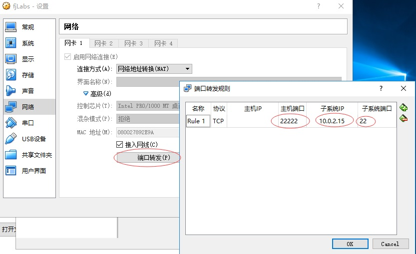
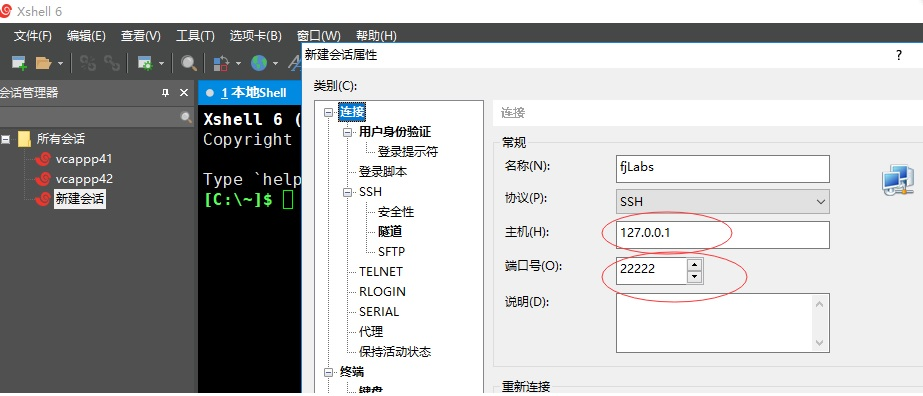

virtualbox Ubuntu18 NAT方式下可以通过设置“端口转发”来实现宿主机对虚拟机的远程访问
1.在virtualbox虚拟机的“网络”配置中设置“端口转发”规则

2.在xshell中新建会话属性中设置主机为127.0.0.1，端口为22222（即上面端口转发规则中配置的主机端口）

3.如果在连接过程中遇到“ssh服务器拒绝了密码“，应该是sshd的设置不允许root用户用密码远程登录 
修改 /etc/ssh/sshd_config文件，注意，安装了openssh才会有这个文件，如果文件不存在请检查是否安装了openssh。
vim /etc/ssh/sshd_config
找到
# Authentication:
LoginGraceTime 120
PermitRootLogin prohibit-password
StrictModes yes

改成
# Authentication:
LoginGraceTime 120
PermitRootLogin yes
StrictModes yes
然后输入命令
/etc/init.d/ssh restart 
重启ssh服务即可。

